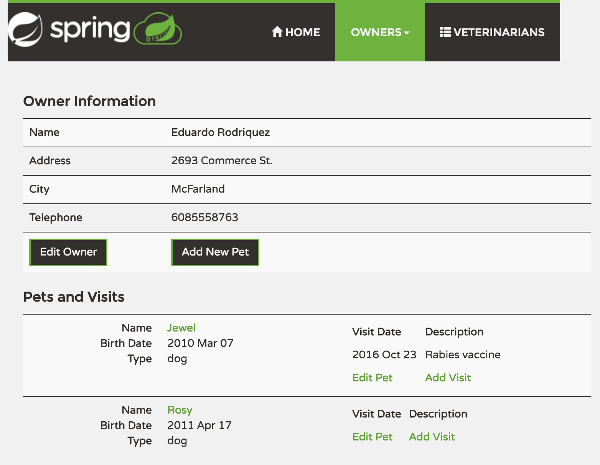
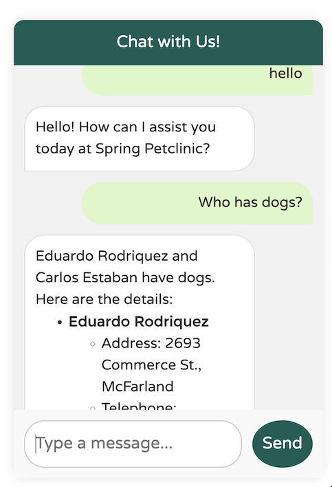
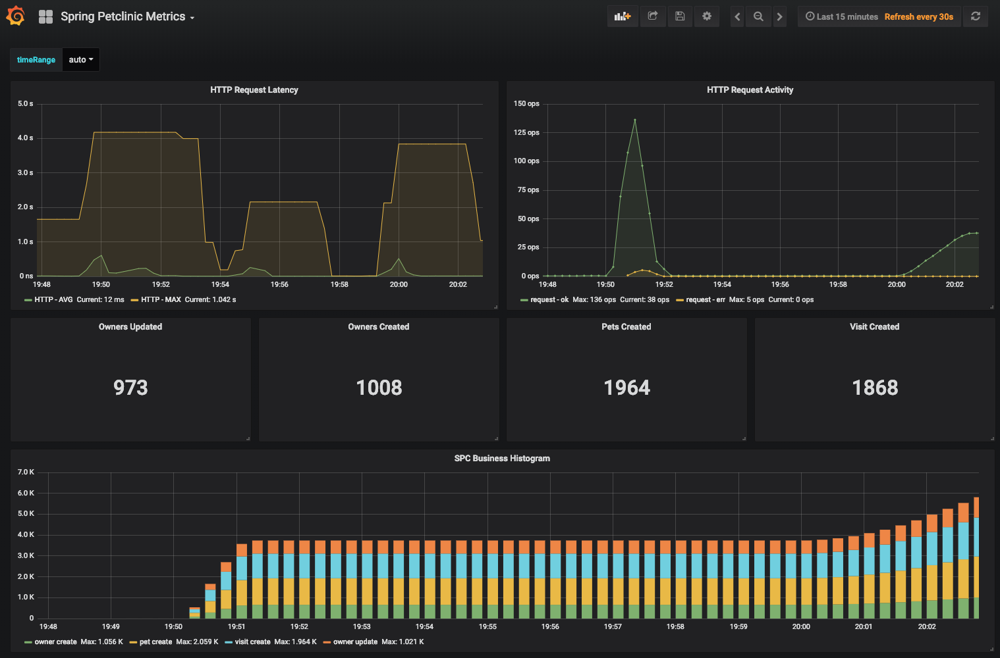

# ppp 示例应用的分布式版本（基于 Spring Cloud 和 Spring AI 构建）

[](https://github.com/spring-petclinic/spring-petclinic-microservices/actions/workflows/maven-build.yml)
[](https://opensource.org/licenses/Apache-2.0)

这个微服务分支最初源自 [AngularJS 版本](https://github.com/spring-petclinic/spring-petclinic-angular1)，用于演示如何将示例 Spring 应用程序拆分为[微服务](http://www.martinfowler.com/articles/microservices.html)。
为了实现这一目标，我们使用了来自 [Spring Cloud Netflix](https://github.com/spring-cloud/spring-cloud-netflix) 技术栈的 Spring Cloud Gateway、Spring Cloud Circuit Breaker、Spring Cloud Config、Micrometer Tracing、Resilience4j、Open Telemetry 和 Eureka Service Discovery。

## 在本地不使用 Docker 启动服务

每个微服务都是一个 Spring Boot 应用程序，可以使用 IDE 或 `../mvnw spring-boot:run` 命令在本地启动。
请注意，在启动任何其他应用程序（Customers、Vets、Visits 和 API）之前，必须先启动支持服务（Config Server 和 Discovery Server）。
Tracing Server、Admin Server、Grafana 和 Prometheus 的启动是可选的。
如果一切顺利，您可以访问以下服务：
* Discovery Server - http://localhost:8761
* Config Server - http://localhost:8888
* AngularJS 前端（API Gateway）- http://localhost:8080
* Customers、Vets、Visits 和 GenAI 服务 - 随机端口，请查看 Eureka Dashboard
* Tracing Server (Zipkin) - http://localhost:9411/zipkin/（我们使用 [openzipkin](https://github.com/openzipkin/zipkin/tree/main/zipkin-server)）
* Admin Server (Spring Boot Admin) - http://localhost:9090
* Grafana Dashboards - http://localhost:3030
* Prometheus - http://localhost:9091

您可以通过使用 `native` Spring Profile 并设置 `GIT_REPO` 环境变量来告诉 Config Server 使用您的本地 Git 仓库，例如：
`-Dspring.profiles.active=native -DGIT_REPO=/projects/spring-petclinic-microservices-config`

## 在本地使用 docker-compose 启动服务

为了使用 Docker 启动整个基础设施，您必须执行以下命令来构建镜像：
```bash
./mvnw clean install -P buildDocker
```
这需要安装并运行 `Docker` 或 `Docker Desktop`。

或者，您也可以在 `Podman` 上构建所有镜像，这需要安装并运行 Podman 或 Podman Desktop。
```bash
./mvnw clean install -PbuildDocker -Dcontainer.executable=podman
```
默认情况下，Docker OCI 镜像是为 `linux/amd64` 平台构建的。
对于其他架构，您可以使用 `-Dcontainer.platform` Maven 命令行参数进行更改。
例如，如果您的目标是 Apple M2 的容器镜像，您可以使用以下命令，指定 `linux/arm64` 架构：
```bash
./mvnw clean install -P buildDocker -Dcontainer.platform="linux/arm64"
```

一旦镜像准备就绪，您可以使用单个命令启动它们：
`docker compose up` 或 `podman-compose up`。

容器的启动顺序通过 Docker Compose [depends-on](https://github.com/compose-spec/compose-spec/blob/main/spec.md#depends_on) 表达式的 `service_healthy` 条件和服务容器的 [healthcheck](https://github.com/compose-spec/compose-spec/blob/main/spec.md#healthcheck) 进行协调。
启动服务后，API Gateway 需要一些时间才能与服务注册表同步，因此不要担心初始的 Spring Cloud Gateway 超时。您可以通过 Eureka Dashboard（默认位于 http://localhost:8761）跟踪服务的可用性。

`main` 分支使用带有 Java 17 的 Eclipse Temurin 作为 Docker 基础镜像。

*注意：在 MacOSX 或 Windows 下，请确保 Docker VM 有足够的内存来运行微服务。默认设置通常不够，会使 `docker-compose up` 运行得非常缓慢。*


## 在本地使用 docker-compose 和 Java 启动服务

如果您在通过 docker-compose 运行系统时遇到问题，可以尝试运行 `./scripts/run_all.sh` 脚本，该脚本将通过 docker-compose 启动基础设施服务，并通过标准的 `nohup java -jar ...` 命令启动所有基于 Java 的应用程序。日志将在 `${ROOT}/target/nameoftheapp.log` 下可用。

每个基于 Java 的应用程序都以 `chaos-monkey` Profile 启动，以便与 Spring Boot Chaos Monkey 交互。您可以查看 (README)[scripts/chaos/README.md] 以获取有关如何使用 `./scripts/chaos/call_chaos.sh` 辅助脚本来启用攻击的更多信息。

## 了解 ppp 应用程序

[查看 Spring Petclinic Framework 版本的演示文稿](http://fr.slideshare.net/AntoineRey/spring-framework-petclinic-sample-application)

[介绍 Spring Petclinic Microservices 的博客文章](http://javaetmoi.com/2018/10/architecture-microservices-avec-spring-cloud/)（法语）

然后您可以在这里访问 petclinic：http://localhost:8080/

## 微服务概述

本项目由以下几个微服务组成：
- **Customers Service（客户服务）**：管理客户数据。
- **Vets Service（兽医服务）**：处理兽医信息。
- **Visits Service（就诊服务）**：管理宠物就诊记录。
- **GenAI Service（生成式 AI 服务）**：提供聊天机器人接口。
- **API Gateway（API 网关）**：将客户端请求路由到适当的服务。
- **Config Server（配置服务器）**：所有服务的集中配置管理。
- **Discovery Server（发现服务器）**：基于 Eureka 的服务注册中心。

每个服务都有其特定的角色，并通过 REST API 进行通信。





**Spring Petclinic Microservices 架构图**


## 集成 Spring AI 聊天机器人

Spring Petclinic 集成了一个聊天机器人，允许您使用自然语言与应用程序交互。以下是一些您可以询问的示例：

1. 请来诊所的主人名单。
2. 有专门做手术的兽医吗？
3. 有一个叫 Betty 的主人吗？
4. 哪些主人有狗？
5. 给 Betty 添加一只狗，名字叫 Moopsie。
6. 创建一个新主人。



这个 `spring-petclinic-genai-service` 微服务目前支持 **OpenAI**（默认）或 **Azure OpenAI** 作为 LLM 提供商。
为了启动微服务，请执行以下步骤：

1. 决定要使用的提供商。默认情况下，启用的是 `spring-ai-starter-model-openai` 依赖。
   您可以在 `pom.xml` 中将其更改为 `spring-ai-starter-model-azure-openai`。
2. 创建 OpenAI API 密钥或在 Azure Portal 中创建 Azure OpenAI 资源。
   请参阅 [OpenAI 快速入门](https://platform.openai.com/docs/quickstart) 或 [Azure 文档](https://learn.microsoft.com/en-us/azure/ai-services/openai/) 以获取更多信息。
   您只需要填充您正在使用的提供商——无论是 openai 还是 azure-openai。
   如果您没有自己的 OpenAI API 密钥，不用担心！
   您可以临时使用 `demo` 密钥，这是 OpenAI 免费提供的用于演示目的的密钥。
   这个 `demo` 密钥有配额限制，仅限于 `gpt-4o-mini` 模型，仅用于演示用途。
   使用您自己的 OpenAI 账户，您可以通过修改 `application.yml` 文件的 `deployment_name` 属性来测试 `gpt-4o` 模型。
3. 将您的 API 密钥和端点作为环境变量导出：
    * 如果使用 OpenAI：
    ```bash
    export OPENAI_API_KEY="your_api_key_here"
    ```
    * 如果使用 Azure OpenAI：
    ```bash
    export AZURE_OPENAI_ENDPOINT="https://your_resource.openai.azure.com"
    export AZURE_OPENAI_KEY="your_api_key_here"
    ```

## 如果您发现 ppp 的错误/建议改进

我们的问题追踪器在这里：https://github.com/spring-petclinic/spring-petclinic-microservices/issues

## 数据库配置

在默认配置中，Petclinic 使用内存数据库（HSQLDB），在启动时会填充数据。
如果需要持久化数据库配置，也提供了类似的 MySQL 设置。
Connector/J（MySQL JDBC 驱动程序）的依赖已包含在 `pom.xml` 文件中。

### 启动 MySQL 数据库

您可以使用 Docker 启动 MySQL 数据库：

```
docker run -e MYSQL_ROOT_PASSWORD=petclinic -e MYSQL_DATABASE=petclinic -p 3306:3306 mysql:8.4.5
```

或者下载并安装 MySQL 数据库（例如 MySQL Community Server 8.4.5 LTS），可以在这里找到：https://dev.mysql.com/downloads/

### 使用 Spring 'mysql' Profile

要使用 MySQL 数据库，您必须使用 `mysql` Spring Profile 启动 3 个微服务（`visits-service`、`customers-service` 和 `vets-services`）。
添加 `--spring.profiles.active=mysql` 作为程序参数。

默认情况下，在启动时将创建数据库模式并填充数据。
您也可以通过执行每个微服务的 `"db/mysql/{schema,data}.sql"` 脚本来手动创建 PetClinic 数据库和数据。
在 [配置仓库] 的 `application.yml` 中，将 `initialization-mode` 设置为 `never`。

如果您使用 Docker 运行微服务，则必须在 (Dockerfile)[docker/Dockerfile] 中添加 `mysql` Profile：
```
ENV SPRING_PROFILES_ACTIVE docker,mysql
```
在 [配置仓库] 的 `application.yml` 的 `mysql 部分`，您必须更改 MySQL JDBC 连接字符串的主机和端口。

## 自定义指标监控

Grafana 和 Prometheus 包含在 `docker-compose.yml` 配置中，面向公众的应用程序已经使用 [MicroMeter](https://micrometer.io) 进行仪器化，以收集 JVM 和自定义业务指标。

一个 JMeter 负载测试脚本可用于压力测试应用程序并生成指标：[petclinic_test_plan.jmx](spring-petclinic-api-gateway/src/test/jmeter/petclinic_test_plan.jmx)



### 使用 Prometheus

* 您可以从本地机器访问 Prometheus：http://localhost:9091

### 使用 Grafana 和 Prometheus

* 设置了匿名访问和 Prometheus 数据源。
* `Spring Petclinic Metrics` 仪表板可在 URL http://localhost:3030/d/69JXeR0iw/spring-petclinic-metrics 访问。
  您可以在这里找到 JSON 配置文件：[docker/grafana/dashboards/grafana-petclinic-dashboard.json]()。
* 您可以通过 Import Dashboard 菜单项创建自己的仪表板或导入 [Micrometer/SpringBoot 仪表板](https://grafana.com/dashboards/4701)。
  该仪表板的 ID 是 `4701`。

### 自定义指标
Spring Boot 注册了大量核心指标：JVM、CPU、Tomcat、Logback...
Spring Boot 自动配置启用了 Spring MVC 处理的请求的仪器化。
所有这三个 REST 控制器 `OwnerResource`、`PetResource` 和 `VisitResource` 都在类级别使用了 `@Timed` Micrometer 注释进行仪器化。

* `customers-service` 应用程序启用了以下自定义指标：
  * @Timed: `petclinic.owner`
  * @Timed: `petclinic.pet`
* `visits-service` 应用程序启用了以下自定义指标：
  * @Timed: `petclinic.visit`

## 寻找特定内容？

| Spring Cloud 组件 | 资源 |
|---------------------------------|------------|
| 配置服务器 | [Config server properties](spring-petclinic-config-server/src/main/resources/application.yml) 和 [配置仓库] |
| 服务发现 | [Eureka server](spring-petclinic-discovery-server) 和 [Service discovery client](spring-petclinic-vets-service/src/main/java/org/springframework/samples/petclinic/vets/VetsServiceApplication.java) |
| API 网关 | [Spring Cloud Gateway starter](spring-petclinic-api-gateway/pom.xml) 和 [Routing configuration](/spring-petclinic-api-gateway/src/main/resources/application.yml) |
| Docker Compose | [Spring Boot with Docker guide](https://spring.io/guides/gs/spring-boot-docker/) 和 [docker-compose file](docker-compose.yml) |
| 断路器 | [Resilience4j fallback method](spring-petclinic-api-gateway/src/main/java/org/springframework/samples/petclinic/api/boundary/web/ApiGatewayController.java) |
| Grafana / Prometheus 监控 | [Micrometer implementation](https://micrometer.io/), [Spring Boot Actuator Production Ready Metrics] |

| 前端模块 | 文件 |
|-------------------|-------|
| Node 和 NPM | [frontend-maven-plugin 插件在本地下载/安装 Node 和 NPM，然后运行 Bower 和 Gulp](spring-petclinic-ui/pom.xml) |
| Bower | [JavaScript 库由清单文件 bower.json 定义](spring-petclinic-ui/bower.json) |
| Gulp | [Gulp 自动化的任务：压缩 CSS 和 JS，从 LESS 生成 CSS，复制其他静态资源](spring-petclinic-ui/gulpfile.js) |
| Angular JS | [app.js、控制器和模板](spring-petclinic-ui/src/scripts/) |

## 推送到 Docker 仓库

`linux/amd64` 和 `linux/arm64` 平台的 Docker 镜像已在 DockerHub 的 [springcommunity](https://hub.docker.com/u/springcommunity) 组织中发布。
您可以拉取镜像：
```bash
docker pull springcommunity/spring-petclinic-config-server
```
您可能更愿意构建然后将镜像推送到自己的 Docker 仓库。

### 选择您的 Docker 仓库

您需要定义目标 Docker 仓库。
确保您已经通过运行 `docker login <endpoint>` 登录，如果只针对 Docker Hub，则运行 `docker login`。

设置 `REPOSITORY_PREFIX` 环境变量以指向您的 Docker 仓库。
如果目标是 Docker Hub，只需提供您的用户名，例如：
```bash
export REPOSITORY_PREFIX=springcommunity
```

对于其他 Docker 仓库，提供仓库的完整 URL，例如：
```bash
export REPOSITORY_PREFIX=harbor.myregistry.com/petclinic
```

要将 `linux/amd64` 和 `linux/arm64` 平台的 Docker 镜像推送到您自己的仓库，请使用以下命令：
```bash
mvn clean install -Dmaven.test.skip -P buildDocker -Ddocker.image.prefix=${REPOSITORY_PREFIX} -Dcontainer.build.extraarg="--push" -Dcontainer.platform="linux/amd64,linux/arm64"
```

一旦使用 `buildDocker` Maven Profile 构建镜像后，也可以使用 `scripts/pushImages.sh` 和 `scripts/tagImages.sh` shell 脚本。
`scripts/tagImages.sh` 需要声明 `VERSION` 环境变量。

## 编译 CSS

在 `spring-petclinic-api-gateway/src/main/resources/static/css` 中有一个 `petclinic.css`。
它是从 `petclinic.scss` 源生成的，结合了 [Bootstrap](https://getbootstrap.com/) 库。
如果您对 `scss` 进行了更改或升级了 Bootstrap，则需要使用 `spring-petclinic-api-gateway` 模块的 Maven Profile `css` 重新编译 CSS 资源。
```bash
cd spring-petclinic-api-gateway
mvn generate-resources -P css
```

